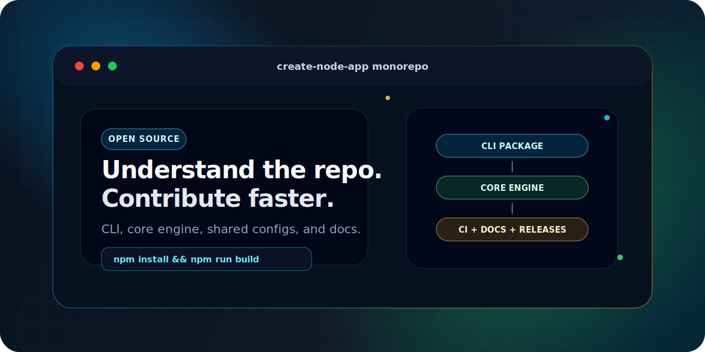

<!--lint disable double-link awesome-heading awesome-git-repo-age awesome-toc-->

<div align="center">




# Create Awesome Node App

**The open-source monorepo behind `create-awesome-node-app`: compose templates and addons into production-ready Node, Web, Full-Stack, Monorepo, and AI-ready projects.**

One command. Any stack.

[](https://github.com/vitejs/awesome-vite#get-started)
[![Tests][testsbadge]][testsurl]
[![Lint][lintbadge]][linturl]
[![Typecheck][typecheckbadge]][typecheckurl]
[![Shellcheck][shellcheckbadge]][shellcheckurl]
[![Markdown][markdownlintbadge]][markdownlinturl]
[![npm][npmversion]][npmurl]
[![Downloads][npmdownloads]][npmurl]
[![License: MIT][licensebadge]][licenseurl]
[](https://github.com/sponsors/ulises-jeremias)
[![AUR][aurbadge]][aururl]
[![Homebrew][homebrewbadge]][homebrewurl]
[![Docker][dockerbadge]][dockerurl]
[](.node-version)
[](.node-version)

[Package README](./packages/create-awesome-node-app/README.md) · [Official Site](https://create-awesome-node-app.vercel.app) · [Templates](https://create-awesome-node-app.vercel.app/templates) · [Extensions](https://create-awesome-node-app.vercel.app/extensions) · [Contributing](./CONTRIBUTING.md) · [Troubleshooting](./docs/TROUBLESHOOTING.md)

</div>

---

## What This Repo Contains

This repository contains the source code for [`create-awesome-node-app`](https://www.npmjs.com/package/create-awesome-node-app), the CLI that composes curated templates, addons, custom options, and AI-ready conventions into working projects.

Use this README if you want to understand the codebase, run it locally, contribute a fix, improve documentation, or work on the CLI packages. If you only want to generate an app, start with the [package README](./packages/create-awesome-node-app/README.md).

---

## Quick Start For Users

```bash
npm create awesome-node-app@latest my-app
```

Run headlessly for scripts, CI, or platform automation:

```bash
npx create-awesome-node-app my-app \
  --template react-vite-boilerplate \
  --addons tailwind-css zustand github-setup \
  --no-interactive
```

More examples live in the [CLI package README](./packages/create-awesome-node-app/README.md).

---

## Repository Map

This is a Node 24+ monorepo managed with npm workspaces and [Turborepo](https://turbo.build/).

| Path                                                                     | Purpose                                                                                                                                |
| ------------------------------------------------------------------------ | -------------------------------------------------------------------------------------------------------------------------------------- |
| [`packages/create-awesome-node-app`](./packages/create-awesome-node-app) | Main CLI package, Commander entrypoint, interactive wizard, catalog listing, and package metadata.                                     |
| [`packages/create-node-app-core`](./packages/create-node-app-core)       | Scaffolding engine: resolves templates/extensions, copies files, applies template options, installs dependencies, and initializes git. |
| [`packages/eslint-config-base`](./packages/eslint-config-base)           | Shared base ESLint flat config.                                                                                                        |
| [`packages/eslint-config-ts`](./packages/eslint-config-ts)               | TypeScript ESLint config extending the base preset.                                                                                    |
| [`packages/eslint-config-react`](./packages/eslint-config-react)         | React ESLint config extending the TypeScript preset.                                                                                   |
| [`packages/eslint-config-next`](./packages/eslint-config-next)           | Next.js ESLint config extending the TypeScript preset.                                                                                 |
| [`packages/tsconfig`](./packages/tsconfig)                               | Shared TypeScript base configurations.                                                                                                 |
| [`docs/`](./docs)                                                        | Brand guidance, troubleshooting, and migration notes.                                                                                  |
| [`.github/workflows`](./.github/workflows)                               | CI for tests, lint, typecheck, shellcheck, markdown, and release automation.                                                           |

Template and extension data is maintained in [`Create-Node-App/cna-templates`](https://github.com/Create-Node-App/cna-templates). This repo consumes that catalog remotely.

---

## Local Development

Requires **Node.js 24.17.0** (the version pinned in `.node-version`; use `fnm use` to switch automatically):

```bash
git clone https://github.com/Create-Node-App/create-node-app.git
cd create-node-app
fnm use    # reads .node-version
npm install
npm run build
```

Run the local CLI after building:

```bash
./packages/create-awesome-node-app/index.js my-app
```

Run a non-interactive local smoke test:

```bash
./packages/create-awesome-node-app/index.js smoke-app \
  --template react-vite-boilerplate \
  --addons tailwind-css \
  --no-interactive \
  --no-install
```

---

## Development Workflow

1. Read the relevant package README before changing code.
2. Make the smallest correct change.
3. Add or update tests when behavior changes.
4. Run the targeted package checks first.
5. Run broader repo checks before opening a PR.
6. Update docs when commands, behavior, package metadata, or contribution paths change.

For contribution requirements and project expectations, see [CONTRIBUTING.md](./CONTRIBUTING.md).

---

## Common Tasks

### Work On The CLI

```bash
npm run build -- --filter create-awesome-node-app
npm run test -- --filter create-awesome-node-app
npm run lint -- --filter create-awesome-node-app
```

Important files:

- [`packages/create-awesome-node-app/src/index.ts`](./packages/create-awesome-node-app/src/index.ts) for CLI flags and execution flow.
- [`packages/create-awesome-node-app/src/options.ts`](./packages/create-awesome-node-app/src/options.ts) for interactive and non-interactive option resolution.
- [`packages/create-awesome-node-app/src/templates.ts`](./packages/create-awesome-node-app/src/templates.ts) for remote catalog loading.
- [`packages/create-awesome-node-app/src/list.ts`](./packages/create-awesome-node-app/src/list.ts) for `--list-templates` and `--list-addons` output.

### Work On The Scaffolding Core

```bash
npm run build -- --filter @create-node-app/core
npm run test -- --filter @create-node-app/core
npm run lint -- --filter @create-node-app/core
```

Important files:

- [`packages/create-node-app-core/index.ts`](./packages/create-node-app-core/index.ts) for the main `createNodeApp` workflow.
- [`packages/create-node-app-core/loaders.ts`](./packages/create-node-app-core/loaders.ts) for template file discovery and rendering.
- [`packages/create-node-app-core/paths.ts`](./packages/create-node-app-core/paths.ts) for local, GitHub, and package path handling.
- [`packages/create-node-app-core/installer.ts`](./packages/create-node-app-core/installer.ts) for install command behavior.

### Work On Templates Or Addons

Template and extension implementations live in [`Create-Node-App/cna-templates`](https://github.com/Create-Node-App/cna-templates), not in this monorepo.

Use local `file://` URLs when developing templates or extensions before publishing them to the catalog:

```bash
npx create-awesome-node-app local-app \
  --template file:///absolute/path/to/my-template \
  --addons file:///absolute/path/to/my-extension \
  --no-interactive
```

For a template inside a monorepo subdirectory:

```bash
npx create-awesome-node-app local-app \
  --template "file:///absolute/path/to/catalog-repo?subdir=templates/my-starter" \
  --no-interactive
```

---

## Quality Checks

| Command                 | What it validates                                          |
| ----------------------- | ---------------------------------------------------------- |
| `npm run build`         | Builds all packages through Turborepo.                     |
| `npm run test`          | Runs package test tasks.                                   |
| `npm run test:all`      | Runs all Node native test files under `packages/**/tests`. |
| `npm run test:coverage` | Builds and runs coverage with c8.                          |
| `npm run lint`          | Runs ESLint across packages.                               |
| `npm run type-check`    | Runs TypeScript checks across packages.                    |
| `npm run format`        | Formats supported files with Prettier.                     |

Run targeted checks while iterating, then run the broader checks before requesting review.

---

## CLI Examples For Debugging

### Catalog Template By Slug

```bash
npx create-awesome-node-app my-react-app --template react-vite-boilerplate
npx create-awesome-node-app my-api --template nestjs-boilerplate
npx create-awesome-node-app my-next --template nextjs-starter
```

### Template + Addons

```bash
npx create-awesome-node-app my-app \
  --template react-vite-boilerplate \
  --addons tailwind-css zustand

npx create-awesome-node-app my-api \
  --template nestjs-boilerplate \
  --addons drizzle-orm-postgresql openapi
```

### Remote GitHub URLs

```bash
npx create-awesome-node-app my-app \
  --template https://github.com/Create-Node-App/cna-templates/tree/main/templates/react-vite-starter \
  --addons https://github.com/Create-Node-App/cna-templates/tree/main/extensions/react-query
```

### Layer Extra Extensions With `--extend`

```bash
npx create-awesome-node-app layered-app \
  --template react-vite-boilerplate \
  --addons tailwind-css \
  --extend https://github.com/Create-Node-App/cna-templates/tree/main/extensions/react-hook-form
```

### Inspect Runtime Configuration

```bash
npx create-awesome-node-app debug-app \
  --template react-vite-boilerplate \
  --verbose
```

---

## Catalog Snapshot

The live catalog changes over time. Use the website or CLI listing commands for the current source of truth.

```bash
npx create-awesome-node-app --list-templates
npx create-awesome-node-app --template react-vite-boilerplate --list-addons
```

Common template slugs:

| Slug                              | Description                                                                                           |
| --------------------------------- | ----------------------------------------------------------------------------------------------------- |
| `react-vite-boilerplate`          | React + Vite + TypeScript starter.                                                                    |
| `nextjs-starter`                  | Production-ready Next.js starter.                                                                     |
| `nextjs-saas-ai-starter`          | Multi-tenant SaaS starter with AI, Auth.js, Drizzle, PostgreSQL, Tailwind, shadcn/ui, RBAC, and i18n. |
| `nestjs-boilerplate`              | Scalable NestJS backend.                                                                              |
| `hono-starter`                    | Lightweight Hono API starter.                                                                         |
| `astro-starter`                   | Astro site starter for content-focused apps.                                                          |
| `remix-starter`                   | React Router v7 / Remix-style full-stack starter.                                                     |
| `turborepo-boilerplate`           | Monorepo with Turborepo and Changesets.                                                               |
| `web-extension-react-boilerplate` | React WebExtension with Vite.                                                                         |
| `webdriverio-boilerplate`         | WebdriverIO E2E testing setup.                                                                        |

Common addon slugs:

| Category       | Examples                                                                         |
| -------------- | -------------------------------------------------------------------------------- |
| UI             | `tailwind-css`, `material-ui`, `shadcn-ui`, `nextjs-shadcn`                      |
| State and data | `zustand`, `jotai`, `tanstack-react-query`, `apollo-client`                      |
| Backend and DB | `drizzle-orm-postgresql`, `drizzle-orm-sqlite`, `mongoose-orm-mongodb`           |
| Testing        | `react-playwright`, `vitest-react-testing-library`, `jest-react-testing-library` |
| Tooling        | `github-setup`, `husky-lint-staged`, `development-container`, `storybook`        |

---

## Release And Publishing Notes

Packages are published from this monorepo. Before publishing, make sure package-level READMEs, changelogs, builds, tests, and package metadata are aligned.

Useful package docs:

- [`packages/create-awesome-node-app/README.md`](./packages/create-awesome-node-app/README.md)
- [`packages/create-node-app-core/README.md`](./packages/create-node-app-core/README.md)
- [`packages/README.md`](./packages/README.md)
- [`packages/create-awesome-node-app/CHANGELOG.md`](./packages/create-awesome-node-app/CHANGELOG.md)

---

## Contributing

Contributions are welcome across docs, CLI behavior, tests, package configuration, shared configs, and developer experience.

Good first steps:

- Read [CONTRIBUTING.md](./CONTRIBUTING.md).
- Check [open issues](https://github.com/Create-Node-App/create-node-app/issues).
- Use [Troubleshooting](./docs/TROUBLESHOOTING.md) when local generation fails.
- Open template or addon changes in [`Create-Node-App/cna-templates`](https://github.com/Create-Node-App/cna-templates).

When opening a PR, include what changed, how you validated it, and whether docs/package metadata were updated.

---

## License

MIT © [Create Node App Contributors](https://github.com/Create-Node-App/create-node-app/graphs/contributors)

---

<div align="center">

**[create-awesome-node-app.vercel.app](https://create-awesome-node-app.vercel.app)**

_Build starters quickly. Understand the repo quickly. Contribute confidently._

</div>

<!-- Reference links -->

[testsbadge]: https://github.com/Create-Node-App/create-node-app/actions/workflows/test.yml/badge.svg
[lintbadge]: https://github.com/Create-Node-App/create-node-app/actions/workflows/lint.yml/badge.svg
[typecheckbadge]: https://github.com/Create-Node-App/create-node-app/actions/workflows/type-check.yml/badge.svg
[shellcheckbadge]: https://github.com/Create-Node-App/create-node-app/actions/workflows/shellcheck.yml/badge.svg
[markdownlintbadge]: https://github.com/Create-Node-App/create-node-app/actions/workflows/markdownlint.yml/badge.svg
[npmversion]: https://img.shields.io/npm/v/create-awesome-node-app.svg?style=flat-square&color=cb3837
[npmdownloads]: https://img.shields.io/npm/dm/create-awesome-node-app.svg?style=flat-square&color=cb3837
[licensebadge]: https://img.shields.io/badge/License-MIT-blue.svg?style=flat-square
[testsurl]: https://github.com/Create-Node-App/create-node-app/actions/workflows/test.yml
[linturl]: https://github.com/Create-Node-App/create-node-app/actions/workflows/lint.yml
[typecheckurl]: https://github.com/Create-Node-App/create-node-app/actions/workflows/type-check.yml
[shellcheckurl]: https://github.com/Create-Node-App/create-node-app/actions/workflows/shellcheck.yml
[markdownlinturl]: https://github.com/Create-Node-App/create-node-app/actions/workflows/markdownlint.yml
[npmurl]: https://www.npmjs.com/package/create-awesome-node-app
[licenseurl]: https://github.com/Create-Node-App/create-node-app/blob/main/LICENSE
[aururl]: https://aur.archlinux.org/packages/create-awesome-node-app
[aurbadge]: https://img.shields.io/aur/version/create-awesome-node-app?style=flat-square&label=AUR&logo=archlinux
[homebrewurl]: https://github.com/Create-Node-App/homebrew-tap
[homebrewbadge]: https://img.shields.io/badge/homebrew-Create--Node--App%2Ftap-orange?style=flat-square&logo=homebrew
[dockerurl]: https://hub.docker.com/r/ulisesjeremias/create-awesome-node-app
[dockerbadge]: https://img.shields.io/docker/v/ulisesjeremias/create-awesome-node-app?style=flat-square&label=Docker&logo=docker&color=2496ED
