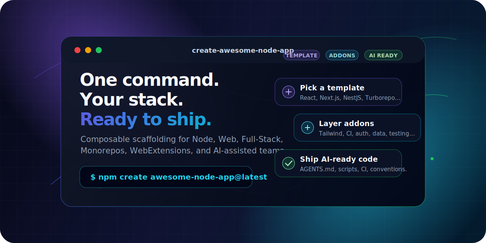

<!--lint disable double-link awesome-heading awesome-git-repo-age awesome-toc-->

<div align="center">



# Create Awesome Node App

**Composable scaffolding for teams that want production code, not starter-code chores.**

Pick a stack, layer addons, generate AI-ready conventions, and ship a fully wired Node/Web project in under a minute.

[![npm][npmversion]][npmurl]
[![Downloads][npmdownloads]][npmurl]
[![Stars][starsbadge]][starsurl]
[![Commit Activity][commitactivitybadge]][commitactivityurl]
[![Bundle Size][bundlesizebadge]][bundlesizeurl]
[](https://github.com/vitejs/awesome-vite#get-started)
[![License: MIT][licensebadge]][licenseurl]

[![Tests][testsbadge]][testsurl]
[![Lint][lintbadge]][linturl]
[![Typecheck][typecheckbadge]][typecheckurl]
[![Shellcheck][shellcheckbadge]][shellcheckurl]
[![Markdown][markdownlintbadge]][markdownlinturl]

**[Official Site](https://create-awesome-node-app.vercel.app)** · [Templates](https://create-awesome-node-app.vercel.app/templates) · [Extensions](https://create-awesome-node-app.vercel.app/extensions) · [Docs](https://create-awesome-node-app.vercel.app/docs) · [GitHub](https://github.com/Create-Node-App/create-node-app) · [npm](https://www.npmjs.com/package/create-awesome-node-app)

</div>

---

## Start In 30 Seconds

```bash
npm create awesome-node-app@latest my-app
```

That single command launches an interactive wizard that helps you choose a template, package manager, addons, and optional custom settings.

Prefer automation? Run the same flow headlessly:

```bash
npx create-awesome-node-app my-app \
  --template react-vite-boilerplate \
  --addons tailwind-css zustand github-setup \
  --use-bun \
  --no-interactive
```

---

## Why Developers Choose CNA

| What you need                  | What CNA gives you                                                                                           |
| ------------------------------ | ------------------------------------------------------------------------------------------------------------ |
| **A real project, fast**       | Production-ready templates with TypeScript, linting, testing, and scripts wired in                           |
| **Your stack, not ours**       | Compose a base template with only the addons you actually want                                               |
| **AI-assisted development**    | Supported templates generate `AGENTS.md` so Copilot, Cursor, Claude, and other agents understand the project |
| **CI-friendly bootstrap**      | Fully non-interactive mode for automation, internal platforms, and repeatable onboarding                     |
| **Private/internal templates** | Use catalog slugs, GitHub URLs, or local `file://` templates and extensions                                  |
| **Modern runtime support**     | Node 22+, npm, yarn, pnpm, and Bun package manager flows                                                     |

**One command. Your stack. Production conventions included.**

---

## The Generation Pipeline

```text
Template → Addons → Custom Options → AI Contract → Install → Git Init → Ready to Ship
```

1. **Choose a template** from the catalog or pass your own GitHub/local URL.
2. **Layer addons** for UI, state, data, testing, CI, auth, release automation, and DX.
3. **Apply custom options** with prompts or `--set key=value` overrides.
4. **Generate AI-ready context** with `AGENTS.md` when supported.
5. **Install dependencies** with npm, yarn, pnpm, or Bun.
6. **Start shipping** from a project that already has conventions.

---

## Built For Real Projects

Every generated project can include:

| Capability            | Included through templates/addons                                         |
| --------------------- | ------------------------------------------------------------------------- |
| TypeScript strictness | Strong defaults, shared configs, and framework-aware setup                |
| Code quality          | ESLint, Prettier, lint scripts, and CI checks                             |
| Testing               | Vitest, Jest, Playwright, Cypress, WebdriverIO, depending on the template |
| Delivery automation   | GitHub Actions, release workflows, commit conventions, changesets         |
| AI context            | `AGENTS.md` with project purpose, scripts, layout, and conventions        |
| Package managers      | npm, yarn, pnpm, and Bun                                                  |

---

## Popular Recipes

### React App With Tailwind And Zustand

```bash
npx create-awesome-node-app my-dashboard \
  --template react-vite-boilerplate \
  --addons tailwind-css zustand \
  --no-interactive
```

### Next.js App With CI Setup

```bash
npx create-awesome-node-app my-saas \
  --template nextjs-starter \
  --addons github-setup commitlint \
  --use-pnpm \
  --no-interactive
```

### NestJS API With Bun

```bash
npx create-awesome-node-app my-api \
  --template nestjs-boilerplate \
  --use-bun \
  --no-interactive
```

### Use Your Own GitHub Template

```bash
npx create-awesome-node-app my-internal-app \
  --template https://github.com/your-org/platform-starters/tree/main/templates/internal-app \
  --no-interactive
```

### Layer A Private Extension

```bash
npx create-awesome-node-app my-app \
  --template react-vite-boilerplate \
  --addons tailwind-css \
  --extend https://github.com/your-org/platform-starters/tree/main/extensions/company-ci
```

### Pass Custom Template Values

```bash
npx create-awesome-node-app my-app \
  --template react-vite-boilerplate \
  --set "productName=Acme Cloud" \
  --set "author=Platform Team" \
  --no-interactive
```

---

## Explore The Catalog

Browse visually at **[create-awesome-node-app.vercel.app](https://create-awesome-node-app.vercel.app)** or discover from the terminal:

```bash
# List all available templates
create-awesome-node-app --list-templates

# List addons compatible with a specific template
create-awesome-node-app --template react-vite-boilerplate --list-addons
```

### Template Families

| Category      | Example templates                                                      |
| ------------- | ---------------------------------------------------------------------- |
| Frontend      | `react-vite-boilerplate` — React + Vite + TypeScript + Vitest          |
| Backend       | `nestjs-boilerplate` — NestJS + TypeScript + Jest                      |
| Full Stack    | `nextjs-starter` — Next.js + SSR + TypeScript                          |
| Monorepo      | `turborepo-boilerplate` — Turborepo + Changesets + shared configs      |
| Web Extension | `web-extension-react-boilerplate` — Cross-browser extension with React |
| UAT / Testing | `webdriverio-boilerplate` — E2E automation scaffold                    |

Full catalog: **[create-awesome-node-app.vercel.app/templates](https://create-awesome-node-app.vercel.app/templates)**

### Addon Families

| Category       | Examples                                             |
| -------------- | ---------------------------------------------------- |
| UI libraries   | Tailwind CSS, Material UI, component systems         |
| State and data | Zustand, Jotai, TanStack Query, Apollo, tRPC         |
| Code quality   | ESLint, Prettier, TypeScript strictness, commitlint  |
| Testing        | Playwright, Cypress, Vitest, Jest                    |
| Delivery       | GitHub Actions, release automation, changesets       |
| DX             | Environment setup, conventions, AI assistant context |

Full catalog: **[create-awesome-node-app.vercel.app/extensions](https://create-awesome-node-app.vercel.app/extensions)**

---

## AI-Ready With `AGENTS.md`

CNA can generate an `AGENTS.md` file in supported templates. That file tells AI coding assistants how to work inside the generated project:

| Context          | Why it matters                                                  |
| ---------------- | --------------------------------------------------------------- |
| Project purpose  | Agents understand what the app is for before editing            |
| Directory layout | Suggestions match the structure instead of inventing one        |
| Scripts          | Agents know how to test, lint, build, and validate              |
| Conventions      | Output follows the team's naming, formatting, and testing rules |

This makes generated projects easier for humans and AI agents to maintain from day one.

Learn more: **[AGENTS.md guide](https://create-awesome-node-app.vercel.app/docs/agents-md)**

---

## Interactive Wizard

Run the CLI without flags and CNA guides you through:

| Step              | What you choose                                                        |
| ----------------- | ---------------------------------------------------------------------- |
| Project name      | Confirm or set the target directory                                    |
| Package manager   | npm, yarn, pnpm, or Bun                                                |
| Category          | Frontend, Backend, Full Stack, Monorepo, Web Extension, UAT, or Custom |
| Template          | Pick from curated starters with descriptions and keywords              |
| Addons            | Multi-select compatible extensions grouped by purpose                  |
| Custom extensions | Add extra URLs or internal blueprints                                  |

The result is a composed `templatesOrExtensions` pipeline that generates your workspace in one shot.

---

## Requirements

- **Node.js >= 22** — enforced at startup, no silent failures.
- npm >= 7, yarn, pnpm, or Bun.

Recommended Node version switching:

```bash
fnm use 22
npm create awesome-node-app@latest my-app
```

---

## CLI Reference

```text
Usage: create-awesome-node-app [project-directory] [options]
```

| Flag                         | Description                                           |
| ---------------------------- | ----------------------------------------------------- |
| `--interactive`              | Force interactive wizard (default outside CI)         |
| `--no-interactive`           | Disable wizard and use flags only                     |
| `-t, --template <slug\|url>` | Template slug from catalog or remote/local URL        |
| `--addons [slugs...]`        | Space-separated addon slugs or URLs                   |
| `--extend [urls...]`         | Extra extension URLs layered on top                   |
| `--set <key=value...>`       | Set custom template options; quote values with spaces |
| `--no-install`               | Generate files without installing dependencies        |
| `--use-yarn`                 | Use yarn instead of npm, pnpm, or Bun                 |
| `--use-pnpm`                 | Use pnpm instead of npm, yarn, or Bun                 |
| `--use-bun`                  | Use Bun instead of npm, yarn, or pnpm                 |
| `--list-templates`           | Print all templates grouped by category               |
| `--list-addons`              | Print addons, optionally filtered by `--template`     |
| `-v, --verbose`              | Output resolved generation config as JSON             |
| `-i, --info`                 | Print Node, npm, and OS diagnostics                   |
| `-V, --version`              | Print CLI version                                     |
| `-h, --help`                 | Show help                                             |

---

## Programmatic Usage

Need to integrate CNA into your own tooling? The core is importable:

```ts
import { createNodeApp, getTemplateDirPath } from "@create-node-app/core";
```

> The programmatic API is experimental and subject to change. Prefer the CLI for stable usage.

---

## FAQ

<details>
<summary><strong>Why another scaffolder?</strong></summary>

Most scaffolders lock you into one stack. CNA is composable: choose a curated template, layer focused addons, and bring your own GitHub or local blueprints when the catalog is not enough.

</details>

<details>
<summary><strong>Can I use my own template?</strong></summary>

Yes. Pass a GitHub URL or local `file://` URL via `--template`:

```bash
npx create-awesome-node-app my-app \
  --template https://github.com/your-org/your-repo/tree/main/template
```

</details>

<details>
<summary><strong>Are addons order-sensitive?</strong></summary>

Yes. They are applied sequentially in the order you specify. If two addons touch the same file, later addons win.

</details>

<details>
<summary><strong>Does it support monorepos?</strong></summary>

Yes. Use `turborepo-boilerplate` for a multi-package workspace with Turborepo, Changesets, and shared TypeScript/ESLint configs.

</details>

<details>
<summary><strong>Can I use it in CI?</strong></summary>

Yes. CNA detects CI and disables interactive mode. Pass all options with flags for repeatable, scripted generation.

</details>

<details>
<summary><strong>Is Node 22 really required?</strong></summary>

Yes. CNA targets the latest LTS runtime for modern ESM, native APIs, and predictable scaffolding behavior.

</details>

---

## Roadmap

- More framework templates and vertical starters.
- Additional testing packs for contracts, performance, and load testing.
- Template version pinning and diff-based upgrade paths.
- Rich template analytics and usage insights.

Track progress in [Issues](https://github.com/Create-Node-App/create-node-app/issues) and [Discussions](https://github.com/Create-Node-App/create-node-app/discussions).

---

## Contributing

Templates, addons, bug fixes, docs, recipes, and ideas are all welcome.

- **Main repo:** [github.com/Create-Node-App/create-node-app](https://github.com/Create-Node-App/create-node-app)
- **Template and extension data:** [github.com/Create-Node-App/cna-templates](https://github.com/Create-Node-App/cna-templates)
- **Contributing guide:** [CONTRIBUTING.md](https://github.com/Create-Node-App/create-node-app/blob/main/CONTRIBUTING.md)

---

## License

MIT © [Create Node App Contributors](https://github.com/Create-Node-App/create-node-app/graphs/contributors)

---

<div align="center">

**[create-awesome-node-app.vercel.app](https://create-awesome-node-app.vercel.app)**

_Built for developers who value speed, clarity, composability, and AI-ready workflows._

</div>

<!-- Reference links -->

[testsbadge]: https://github.com/Create-Node-App/create-node-app/actions/workflows/test.yml/badge.svg
[lintbadge]: https://github.com/Create-Node-App/create-node-app/actions/workflows/lint.yml/badge.svg
[typecheckbadge]: https://github.com/Create-Node-App/create-node-app/actions/workflows/type-check.yml/badge.svg
[shellcheckbadge]: https://github.com/Create-Node-App/create-node-app/actions/workflows/shellcheck.yml/badge.svg
[markdownlintbadge]: https://github.com/Create-Node-App/create-node-app/actions/workflows/markdownlint.yml/badge.svg
[npmversion]: https://img.shields.io/npm/v/create-awesome-node-app.svg?style=flat-square&color=cb3837
[npmdownloads]: https://img.shields.io/npm/dm/create-awesome-node-app.svg?style=flat-square&color=cb3837
[starsbadge]: https://img.shields.io/github/stars/Create-Node-App/create-node-app?style=flat-square&color=yellow
[licensebadge]: https://img.shields.io/badge/License-MIT-blue.svg?style=flat-square
[testsurl]: https://github.com/Create-Node-App/create-node-app/actions/workflows/test.yml
[linturl]: https://github.com/Create-Node-App/create-node-app/actions/workflows/lint.yml
[typecheckurl]: https://github.com/Create-Node-App/create-node-app/actions/workflows/type-check.yml
[shellcheckurl]: https://github.com/Create-Node-App/create-node-app/actions/workflows/shellcheck.yml
[markdownlinturl]: https://github.com/Create-Node-App/create-node-app/actions/workflows/markdownlint.yml
[npmurl]: https://www.npmjs.com/package/create-awesome-node-app
[licenseurl]: https://github.com/Create-Node-App/create-node-app/blob/main/LICENSE
[starsurl]: https://github.com/Create-Node-App/create-node-app/stargazers
[commitactivitybadge]: https://img.shields.io/github/commit-activity/m/Create-Node-App/create-node-app?style=flat-square&logo=github&label=commits
[commitactivityurl]: https://github.com/Create-Node-App/create-node-app/pulse
[bundlesizebadge]: https://img.shields.io/bundlephobia/minzip/create-awesome-node-app?style=flat-square&label=size
[bundlesizeurl]: https://bundlephobia.com/package/create-awesome-node-app
